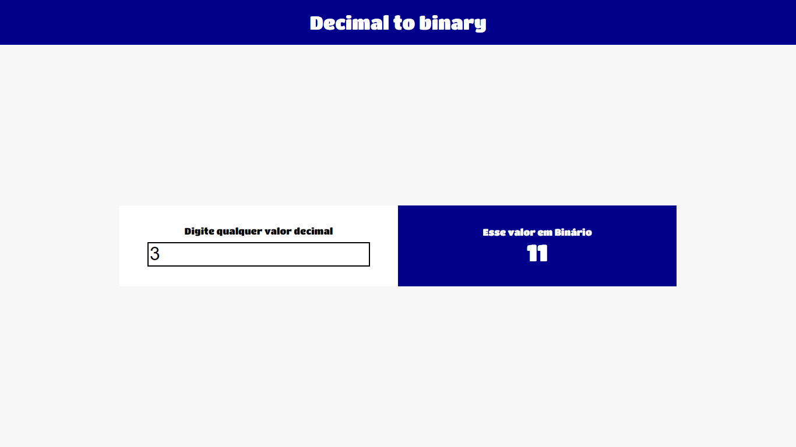

<h1 align="center"> Conversor de números decimais em binários </h1>

  

## 💻Tecnologias

Esse projeto foi desenvolvido com as seguintes tecnologias:

- HTML, CSS e JavaScript.

## 🚀 Projeto

Uma forma fácil de converter números decimais em binários.

Link para visualizar o projeto: 

## :memo: Licença

Esse projeto está sob a licença MIT.

---
 

  

